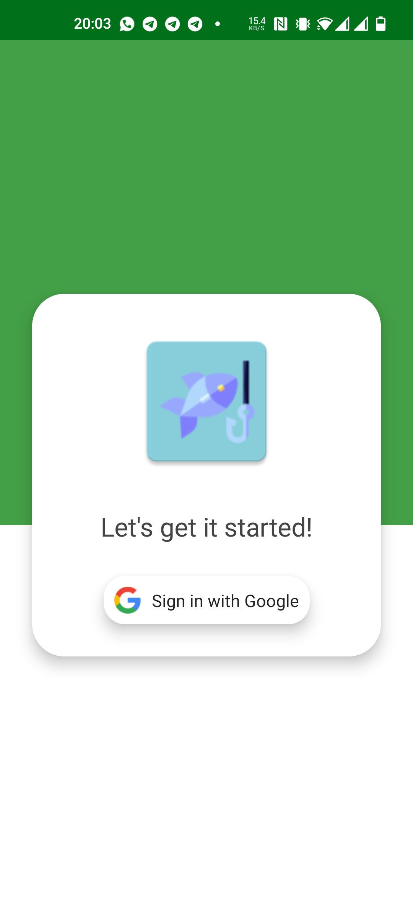
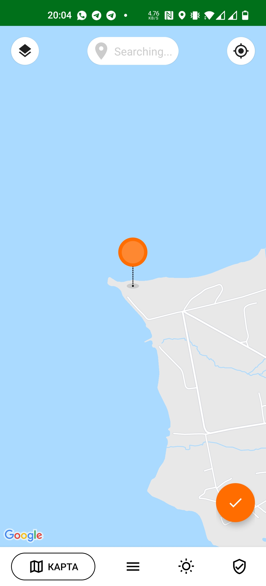
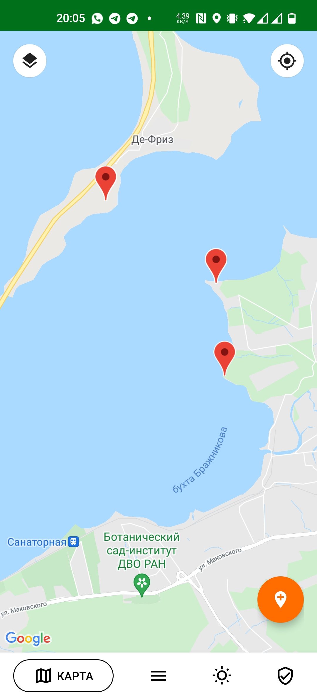
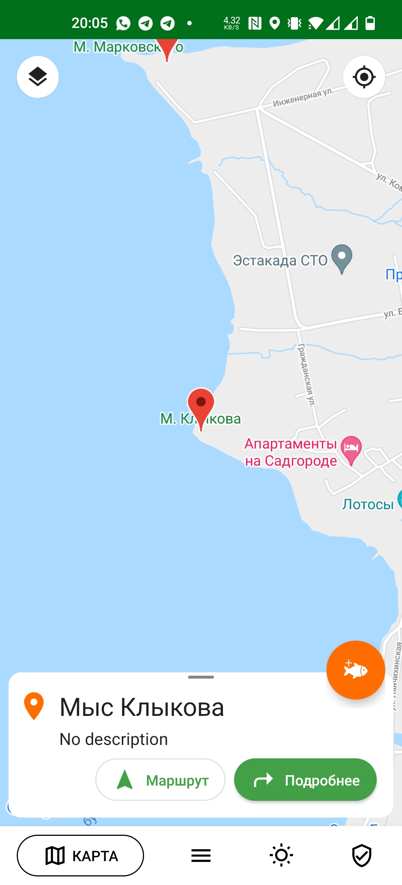
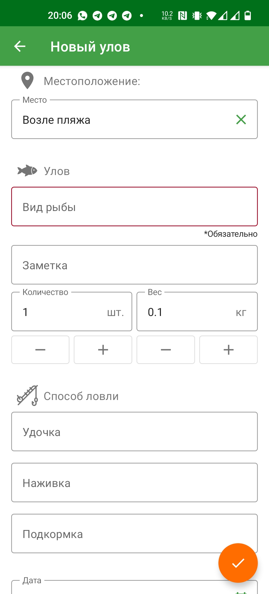
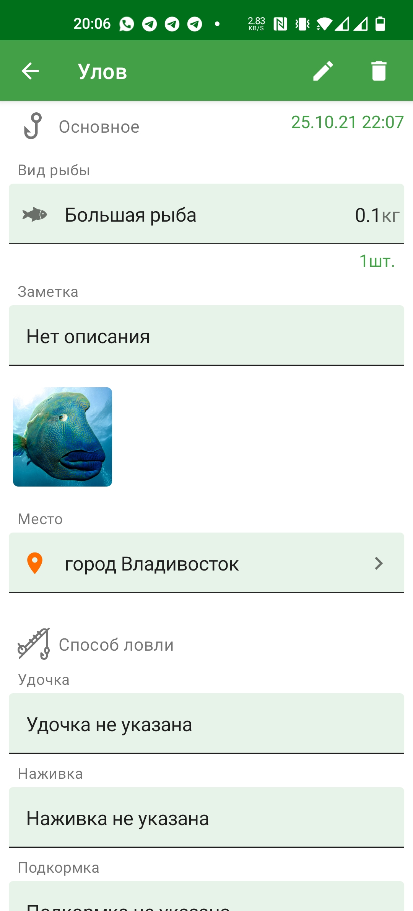
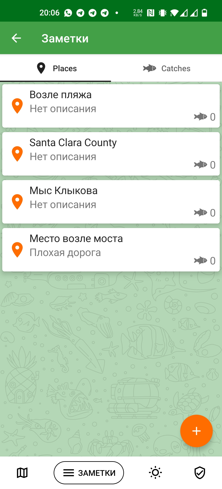
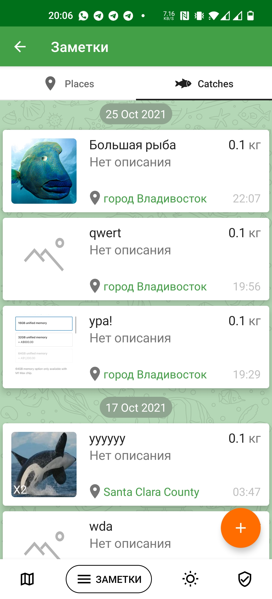

## Download

Fishing Notes
=================
Fishing notes is an Android app for fishermen who whant to remember their fish spots on the map, save cathes on this spots, and share it with friands and other users.

The project is in active development, and not all functionality is available.

Used libraries:
---------------
-   Retrofit - https://square.github.io/retrofit/
-   Koin - https://insert-koin.io/
-   Bottom Picker - https://github.com/ParkSangGwon/TedBottomPicker
-   Coil - https://coil-kt.github.io/coil/
-   Firebase - https://firebase.google.com/
-   Jetpack compose - https://developer.android.com/jetpack/compose
-   Lottie - https://github.com/airbnb/lottie-android

Main features:
--------------
-   Save fish spots on the map
-   Save catches on fish spots with fish type and amount, fishing method, weather, and photos
-   Share spots and cathes with friends or other users
-   Detailed weather forecast for a day and for a week
-   Cloud storege of user data

Screenshots
-----------
  
  
 
